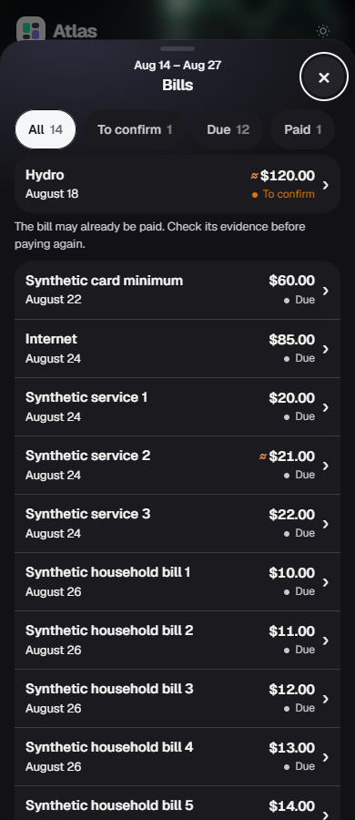

# Bills usability proof

All images use invented fixture bills through the native App → Forecast → Budget path. No household screenshots, data, credentials, or provider calls are included.

Original reproduction base: `4c98234cc7e10d97c8301edcb667d805c80e6964`.
Integrated released main: `5dceb7c6d4f673e4b464c34021b2266f6beb2313` (#562).
Latest clean-source proof: `05cd2c98e31884b10b0e113a40f2aac22b000cbf`.
The Bills implementation is unchanged from reviewed head `1436e0de23ea75825427b4f53e799860233a8b17`; this follow-up adds browser coverage and provenance, plus the released-main integration. The subsequent proof-only commit leaves every exercised implementation, dependency, fixture and test blob unchanged. #563 remains pending and needs integration before final release approval.

## Current-main reproduction

[Baseline report](baseline-reproduction.json) records the exact committed asset hashes. Clicking the square background did nothing; clicking a four-bill day opened only its first bill. The hero Bills sheet used 40px detail amounts and approximately 122px summaries.


## Repaired native lists

[Source-bound report](report.json) records the clean tested head/tree and SHA-256/Git-blob identity of every served asset and the 19-file CommonJS test/fixture dependency closure, including lazily loaded preprocessing modules and package manifests. It also records Node/Playwright/Chromium versions, fixture input hashes and SHA-256/byte lengths for all 30 screenshots. Each of the six viewport/theme cases uses the same invented input hash.

The screenshots cover 1440px, 390px and 320px in light and dark themes at 900px height. Normal-motion Bills/Income pixel pairs were inspected for every viewport/theme, plus desktop and mobile Period figures/Back views. Their compact text, right-aligned amounts, tight divided rows, native sheet controls and readable mobile wrapping match the existing Income treatment. The original reduced-motion day/list views were inspected in the initial proof.

The four-bill day exposes its four original roster rows once. Each keeps its native id/date detail handler. One native dialog owns the roster, details and Back. The hero opens the same compact native roster: 15px names/amounts, at least 56px desktop rows and 64px mobile rows. Twelve of fourteen rows fit in the desktop viewport. Scrolling reaches the final bill.





## Deterministic checks

```text
node test/test-budget-surface.js
node test/test-budget-detail-sheet-controller.js
node test/test-budget-review-regressions.js
node test/test-budget-ui-polish.js
node test/test-budget-stepped-layout.js
node test/test-budget-plan-status-scope.js
node test/test-bill-detail.js
node test/test-paid-actual-display-trust.js
```

All eight focused suites passed. The optional browser proof passed with Playwright available through NODE_PATH, CHROME_PATH pointing to installed Chromium, BILLS_PROOF_DIR outside Git, and BILLS_SOURCE_BOUND=1:

```text
node test/browser-bills-usability.js
```

It covers square background, logo and count activation; four, single and empty days; Enter/Space; repeated day/hero/detail activation; every day occurrence's native evidence identity; Back/Close/Escape focus; same-period list/detail remounts; native filters; period switches; original paid/uncertain states; unchanged App.data; mobile scrolling; and one modal. No browser errors or write requests occurred.

The follow-up adds 42 focused flow records across all six viewport/theme combinations:

- Normal WAAPI motion is active during native DOM click bursts, bypassing Playwright's animation/stability waits. Repeated day/hero open and Close, Close/reopen reversal, and repeated detail/Back retain one native sheet and the correct frame count.
- Escape dismisses and restores focus. Resize cancels decoration while retaining the native day list. A real App remount cancels the detached animation and restores the native day. Departure shells disappear or are cancelled by reversal/repeated Close.
- Period figures → Why moves the original deduction source into the existing dialog. Back returns to Why with the disclosure expanded and the Paid filter retained; reopening Why then Close restores the hero opener. The selected pay period and App.data remain unchanged.

Projected day ARIA state is cleared by the native asynchronous close event. The report distinguishes its transient value at native close from its verified false value after that event; modal closure and focus restoration happen immediately. No implementation change was needed to pass these flows. The native-sheet unit suite was rerun and passed.

```text
npm test
```

The full Windows run is in progress at publication. Its private-history suite fails with `history-io-failed`; the identical failure was reproduced on an untouched base worktree with `node test/test-private-period-history.js`. No full-suite PASS is claimed. Hosted Linux checks remain pending.

## Reference and scope limits

Private owner Bills and Income pixels were inspected before implementation and retained outside Git. Supported Library prepare_materialize succeeded, but its resolved-reference helper failed on Windows with `AttributeError: module 'os' has no attribute 'setxattr'`; compliant original-file materialization could not complete. A browser inspection of those resolved references supplied the pixel comparison.

This change filters already-published native rows and changes hit targets/list density. Forecast amounts, calculations, settlement labels, trust, data mappings, provider actions and individual detail renderers remain unchanged. Systems review is PENDING; this proof is not a review PASS.
