# Bills usability proof

Every public image uses invented fixture bills through the native App → Forecast → Budget path. No household references, data, credentials or provider calls are included.

Original reproduction base: `4c98234cc7e10d97c8301edcb667d805c80e6964`.
Integrated released main: `5dceb7c6d4f673e4b464c34021b2266f6beb2313` (#562).
Latest clean-source proof: `58023f8845e32de63f71f401482aefb829cd9863`.
The subsequent proof-only commit leaves every exercised implementation, dependency, fixture and test blob unchanged. #563 still needs integration after its separately owned release, before final approval.

## Exact-main reproduction and tester triage

The [original baseline report](baseline-reproduction.json) binds its committed assets. Background activation did nothing, a four-bill day opened only the first detail, and the hero sheet repeated approximately 122px summaries with 40px amounts.

The [fresh exact-main probe](main-5d-triage.json) repeats those results at 5dceb7c. Its background click actually targets the day span; it opens no dialog. The icon opens one detail and zero roster rows. The focus outline surrounds the 28px icon inside a roughly 91×80px desktop square. The report binds every served file and fixture dependency to Git/SHA-256, plus input, probe and screenshot hashes. [Probe source](main-5d-probe.cjs) accepts BILLS_MAIN_SOURCE (a clean 5d checkout), BILLS_MAIN_PROOF_DIR and CHROME_PATH, with Playwright on NODE_PATH.

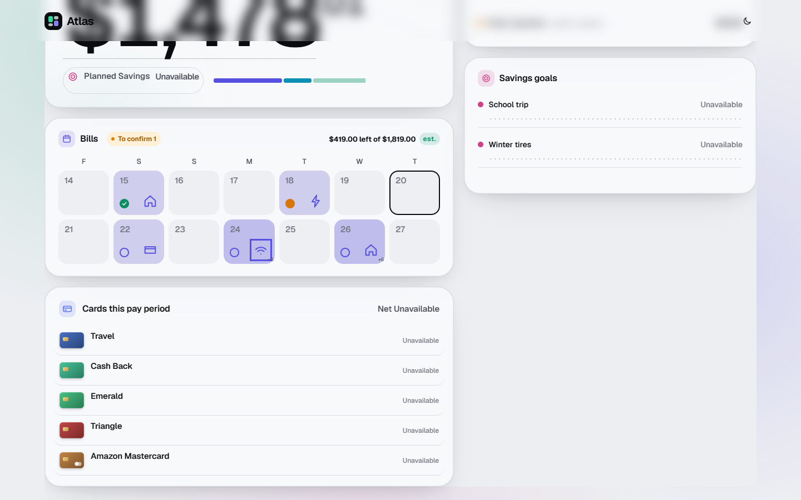
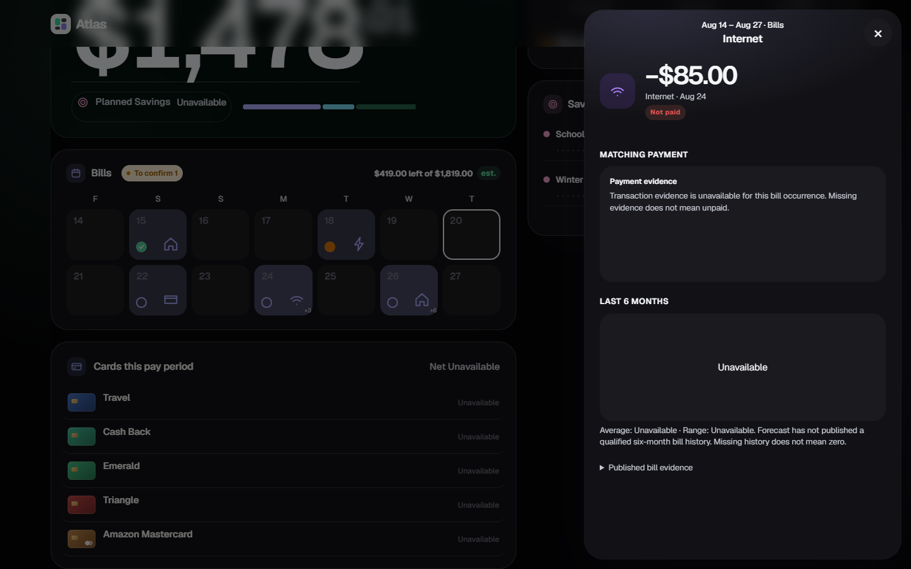
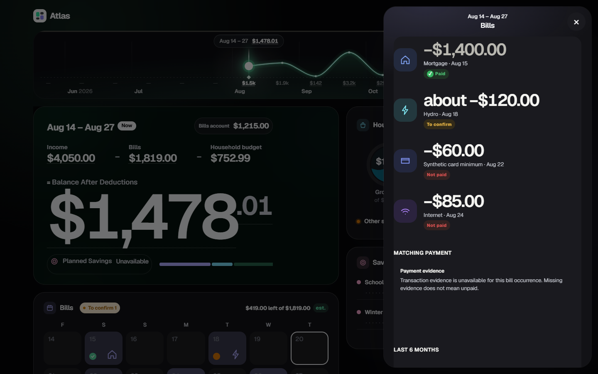

Regular calendar heading → Escape restored the heading in the exact-main fixture. The reported production-target failure is not claimed reproduced; the tester's exact live URL/day remains unresolved. The source-bound offline target is http://bills.test, not production.

A new rapid cross-origin regression did reproduce a concrete defect on c92e1e5: day Close → immediately open the Bills heading → Escape restored the previous day. The old skin close-event fallback survived the new native opener. The bounded fix releases that stale projected opener before heading/hero open; the native sheet then retains the correct current origin. No financial behavior changed.

## Repaired native lists and pixels

The [source-bound report](report.json) records the clean tested head/tree and Git-blob/SHA-256 identity of every served asset and the 19-file CommonJS test/fixture dependency closure, including lazy preprocessing and package manifests. It includes runtime versions, the identical invented input hash for all six cases, and SHA-256/byte lengths for all 36 screenshots.

Views cover 1440px, 390px and 320px in light/dark at 900px height. Fresh normal-motion Bills/Income pixel pairs and keyboard-focus views were inspected across every width/theme, plus desktop/mobile Period figures/Back. Compact names and amounts are 15px, with at least 56px desktop and 64px mobile rows. Twelve of fourteen rows fit on desktop; scrolling reaches the final bill. Fixture amounts, including the four-digit mortgage and original estimate cues, fit on one line without overflow at all six widths/themes. No claim is made about the tester's unspecified live wrapped amount.

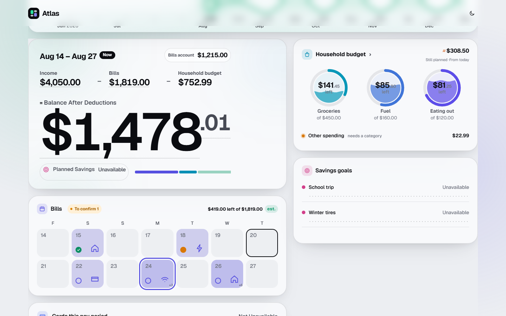
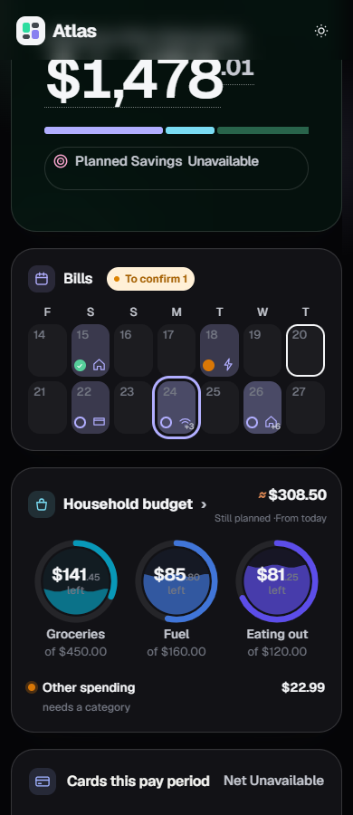
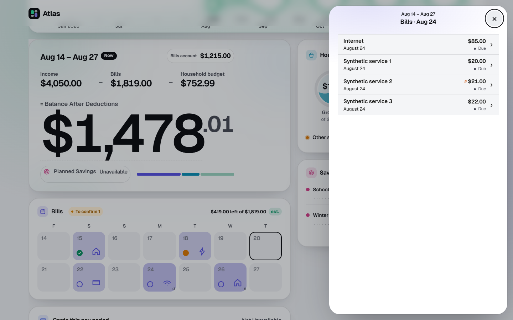
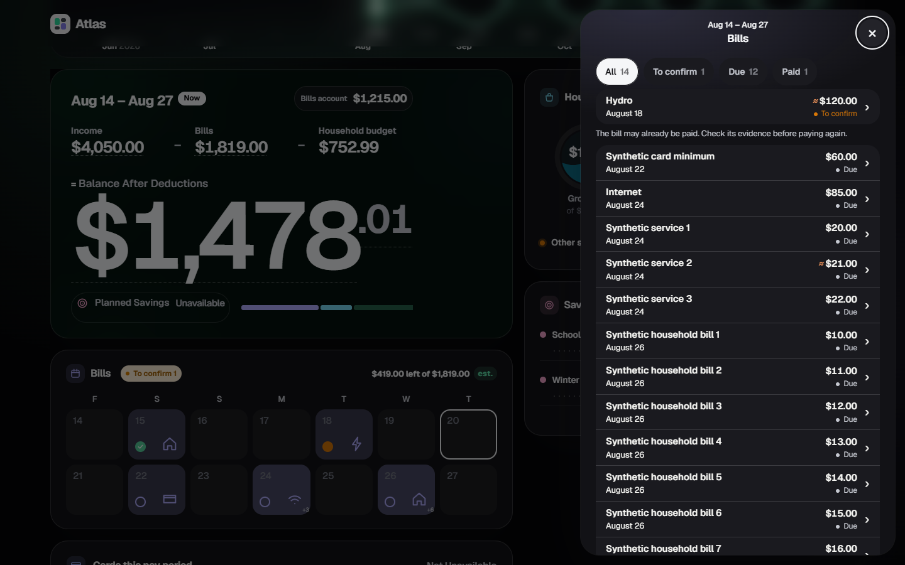
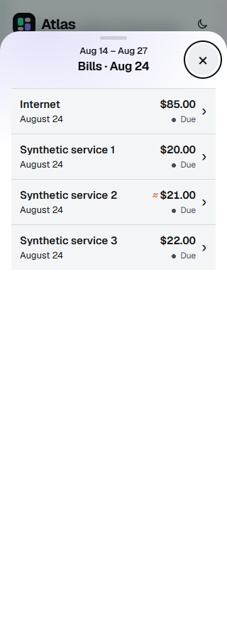
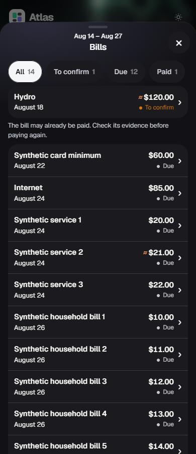
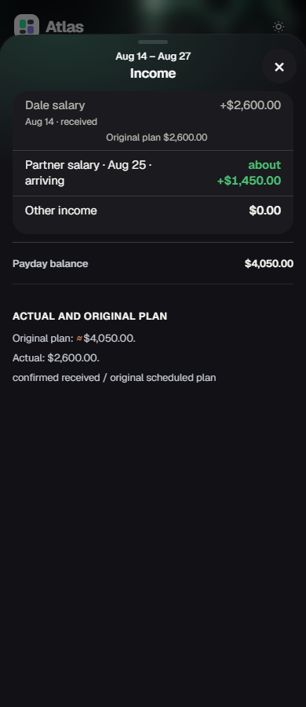
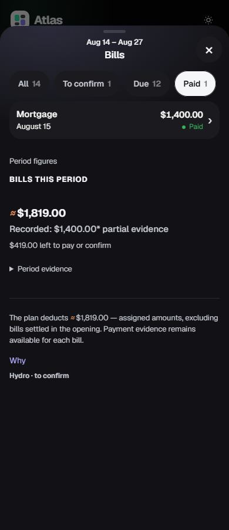

Every day occurrence opens its original id/date evidence. One native dialog owns list/detail/Back. Empty days remain inert and have no tab stop. Both heading and hero are actionable; no unrelated summary or timeline tab stops were changed. Native roster/detail status wording and original paid/uncertain/estimate semantics are retained. Exact-main pixels already show Internet as Due in the roster and Not paid in its detail (whose data-bill-status is still due), with the original missing-evidence qualifier. That existing wording difference is preserved rather than reinterpreted.

## Checks

All eight focused suites were rerun after the focus fix and passed:

```text
node test/test-budget-surface.js
node test/test-budget-detail-sheet-controller.js
node test/test-budget-review-regressions.js
node test/test-budget-ui-polish.js
node test/test-budget-stepped-layout.js
node test/test-budget-plan-status-scope.js
node test/test-bill-detail.js
node test/test-paid-actual-display-trust.js
```

With installed Playwright/Chromium, NODE_PATH, CHROME_PATH, BILLS_PROOF_DIR outside Git, and BILLS_SOURCE_BOUND=1:

```text
node test/browser-bills-usability.js
```

The browser proof passed with 72 focused flow records and no browser errors/write requests. It covers square background/logo/count, full-square keyboard focus, four/single/empty days, every occurrence's native detail, Enter/Space, repeated day/hero/detail activation, one modal, Back/Close/Escape focus, same-period remounts, native filters, period switches, mobile scrolling and immutable App.data.

Normal WAAPI entry/detail motion is active during DOM click bursts. Repeated open/Close, Close/reopen, detail/Back, resize cancellation and remount cancellation retain the correct native stack and remove decorative shells. Explicit heading Enter/Escape and rapid day Close/new heading or hero/Escape now restore the exact origin in every width/theme. Projected day ARIA clears on asynchronous native close; transient and settled values are separately recorded.

Period figures → Why moves the original deduction source into the same sheet. Back restores Why focus, the expanded disclosure and Paid filter. Why → Close restores the hero. Selected pay period remains unchanged.

```text
npm test
```

The fresh final-source Windows full run is in progress at publication. The earlier full run was stopped when the focus fix made that head obsolete. It had a private-history `history-io-failed` failure reproduced identically on unchanged base; no full-suite PASS is claimed. Hosted Linux checks remain pending. The draft is published before long CI completes.

## Reference and scope limits

Private owner Bills/Income pixels were inspected before implementation and retained outside Git. Supported Library prepare_materialize succeeded, but its resolved-reference helper failed on Windows with `AttributeError: module 'os' has no attribute 'setxattr'`; compliant original-file materialization remains blocked. Inspection used the resolved browser references.

This change filters already-published native rows and changes hit targets, list density and opener focus. Forecast amounts, calculations, settlement labels, trust, mappings, provider actions and individual detail renderers remain unchanged. Systems review is PENDING. No merge or self-issued Systems PASS.
